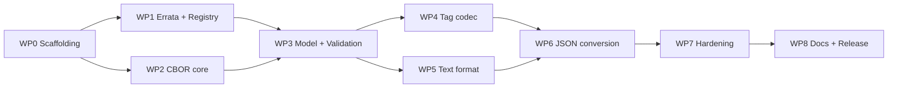

# Metrological CBOR (mCBOR) — TypeScript Reference Implementation

**Work plan, v1.0 — 2026-08-18** · *revised 2026-08-21, after the first npm release*

| | |
|---|---|
| Normative input | [spec/README.md](spec/README.md) (CBOR tag 44252, v1.0, 2026-08-14), [spec/IANA-registration.md](spec/IANA-registration.md), [spec/tag-44252-signed-example.md](spec/tag-44252-signed-example.md) |
| Deliverable | A TypeScript NPM module that parses and writes mCBOR (tag 44252) and converts mCBOR documents from/to JSON, where every metrological value becomes a single string (`"230 V"`) |
| Project language | English (code, comments, docs, commit messages) |
| License | Apache-2.0 (matching the Styx reference implementation; note ChargyCore.TS itself is AGPL-3.0 — only its *tooling* is mirrored, no code is reused) |
| Tooling model | [ChargyCore.TS](https://github.com/OpenChargingCloud/ChargyCore.TS): tsup build, Vitest, ESLint flat config, GitHub Actions CI + nightly, scoped public NPM package |

---

## 1. Goal and scope

Build the reference implementation of CBOR tag 44252 for the TypeScript/JavaScript ecosystem: a small, zero-runtime-dependency library that

1. **decodes and encodes** metrological values — exactly, deterministically, and with every MUST of the specification enforced;
2. **renders and parses** a human-readable text form (`"1.10 kWh"`, `"(230.00 ±0.12) V, k=2"`) that is lossless against the binary form;
3. **converts whole CBOR documents from/to JSON**, representing each metrological value as one string.

### In scope

- CBOR tag 44252 codec: value (int / decimal fraction incl. bignum mantissa), unit (registry id, symbol, product of powers with rational exponents), SI prefix, GUM uncertainty (bare number and map form).
- The unit registry of spec §4 as a data file, including aliases, the affine marker (°C), the SenML symbol mapping, and an API to register private-use ids (≥ 32768).
- A minimal deterministic CBOR core (RFC 8949 subset) sufficient to encode/decode tag content and to walk arbitrary CBOR documents for the JSON conversion.
- A specified text grammar (own document) + renderer + parser.
- Document-level JSON conversion in both directions.
- Conformance test suite: golden vectors from spec §5, the worked signed example, property-based round-trips, a negative test per normative MUST.
- NPM publishing, dual ESM/CJS output, browser + Node. *(Revised after WP8: publishing is a hand operation with MFA and no credential lives in the repository — npm provenance is given up with it, for the reasons in [docs/releasing.md](docs/releasing.md).)*

### Out of scope (deliberately, matching spec §6a)

- COSE signing/verification (a verification *demo* against the worked example lives in `examples/`, with dev-only crypto deps — never in the library).
- Unit *conversion* (Wh→J, °C→K). The registry carries no conversion factors, and the spec warns against naive affine scaling. Comparison stays representation-exact (§6 of the spec).
- Asymmetric uncertainties and correlations (spec §3.4 places them outside the tag).
- Traceability metadata (time, instrument, certificate) — belongs to the carrying document.

---

## 2. What the spec binds the implementation to

A digest of the hard requirements the design below must honor; the full clause-by-clause mapping is a deliverable of WP7 (conformance matrix).

- **Exact decimal arithmetic, no floats — ever.** Values are CBOR ints or tag-4 decimal fractions with int/bignum mantissa. Binary floats and bigfloats (tag 5) are errors as values. JavaScript `number` must never carry a mantissa: `BigInt` throughout.
- **The written representation is data.** `4([-1, 50])` (5.0) and `5` are different resolutions and both must survive decode→encode byte-identically. Same for numeric-id vs. symbolic units.
- **Deterministic encoding** per RFC 8949 §4.2.1: shortest integer heads, definite lengths, sorted map keys. Encoding must be a pure function of (value, scale, unit, prefix, uncertainty) so outputs are signable.
- **Reject, don't guess** (spec §7): unknown unit id or symbol → error, never a placeholder. Resource bounds on exponents and bignum sizes; reject what cannot be represented exactly, never round silently.
- **Validation rules**: array length 2–4; prefix one of the 25 canonical exponents; prefix written explicitly when uncertainty follows; uncertainty non-negative, magnitude/k kept as reported (never normalised to u); coverage probability in ]0, 1]; distribution 0 must be omitted; rational unit exponents reduced to lowest terms, denominator > 0, numerator ≠ 0; a single named unit never encoded as a one-element array; unit id 0 and ids > 65535 invalid.
- **A missing uncertainty means "not stated", never "zero".** The model must distinguish `undefined` from 0.

---

## 3. Key design decisions

Each decision is stated with its recommendation; changing one early is cheap, later expensive. Open points that need the maintainer's word are collected in §10.

### D1 — Own minimal CBOR core, zero runtime dependencies

Implement a small RFC 8949 subset (ints, bignums tag 2/3, decimal fractions tag 4, text/byte strings, arrays, maps, tags, simple values) with a deterministic writer, instead of depending on `cbor2`/`cbor-x`.

*Why:* legal metrology wants an auditable, pinned supply chain (ChargyCore pins even PDF.js for this reason); deterministic byte control and BigInt decimal fractions are exactly the places where generic libraries take liberties; the required subset is small. The Styx reference implementation made the same call.
*Trade-off:* more code to test → mitigated by golden vectors, property tests and fuzzing (WP7). Adapters for `cbor2`/`cbor-x` users are a post-1.0 backlog item.

### D2 — Number model: `bigint` mantissa, spelling-preserving

```ts
type DecimalNumber =
  | { kind: 'int';     value: bigint }                       // wire: major type 0/1
  | { kind: 'decimal'; mantissa: bigint; exponent: number }  // wire: tag 4
```

The `kind` preserves the wire spelling (`5` vs `4([0, 5])` are both legal; only the first is SHOULD). Exponents are validated integers within configurable bounds (default e.g. |e| ≤ 10 000); mantissa size bounded in bytes. Rendering `1.10` from `(mantissa 110, exponent −2)` is pure string arithmetic — no float ever touches the path.

### D3 — Unit model: registry as one data source, wire spelling retained

```ts
type UnitRef    = NamedUnitRef | UnitFactor[];
type NamedUnitRef = { form: 'id'; id: number } | { form: 'symbol'; text: string };
type UnitFactor = [NamedUnitRef, Exponent];
type Exponent   = number | { num: number; den: number };   // reduced, den > 0, num ≠ 0
```

- `src/registry/units.json` is the single source of truth: id, symbol, name, aliases, affine flag, SenML symbol. Code (constants like `Units.Volt`, lookup maps) is generated from it at build time, so spec and code cannot drift.
- Decoded units remember whether the wire said `04` or `"A"` (and which alias), so *preserve* mode re-encodes byte-identically; *canonical* mode (default for fresh values) emits numeric ids and table symbols per the spec's SHOULDs.
- `UnitRegistry.registerPrivate(id ≥ 32768, …)` enables the private-use range per instance; unregistered ids stay errors.

### D4 — Text format: an own specified grammar (the heart of the JSON mapping)

The string form is not cosmetic — it must be **lossless**: mCBOR → string → mCBOR reproduces the same bytes (in canonical mode). That requires a real grammar, published as [docs/text-format.md](docs/text-format.md) (ABNF + normalization rules + test table), frozen in WP5. Cornerstones:

- **Canonical output follows the spec's own diagnostic style**: `5.0 mA`, `9.81 m·s⁻²`, `4.5 nV·Hz^-1/2`, `(230.00 ±0.12) V, k=2`. Integer unit exponents render as superscripts, rational ones in caret form, factors joined by U+00B7.
- **Tolerant input**: ASCII alternatives accepted (`m*s^-2`, `m s^-2`, `um` → µm is **not** accepted — but both micro signs U+00B5/U+03BC are, likewise Ω/Ω U+2126/U+03A9; NFC normalization first). Decimal point only, optional scientific notation (`4.5e-9` ≡ mantissa 45, exponent −10) for extreme scales; digits map exactly to (mantissa, exponent), so trailing zeros survive (`4.500` ≠ `4.5`).
- **Prefix+symbol tokenization**: try the whole token as a registered symbol/alias *first*, then split prefix + symbol. This resolves `cd` (candela, not centi-day), `min`, `Pa`, `Wh`, `mol`, `kat`; `kg` correctly becomes kilo+gram (there is no `kg` in the registry — spec's mass note). Case-sensitive throughout (`t` tonne vs `T` tesla). The full ambiguity table becomes a fixture test. Known oddity to document: `dB` parses as deci-byte, since the bel is not registered.
- **Prefix rendering rule**: fold the prefix into the symbol only where that is SI-correct — single named units with implicit exponent 1 (`mA`, `kWh`, `m°C`). For `m²`, `m³` and products whose first factor's exponent ≠ 1, folding would lie (`km²` ≠ 10³ m²); render `5×10³ m²` instead (input accepts both `×10³` and `e3` spellings).
- **Uncertainty**: `(value ±U) unit` core form; extensions in reported order: `, k=2`, `, p=0.95`, `, dist=normal|rectangular|triangular|u-shape|t`, `, ν=45` (`nu=45` accepted as ASCII input). Exact token set fixed in the grammar doc.
- **Dimensionless (unit `one`)**: rendered as the bare number; a bare number parses back to unit 1. Percent, permille, ppm render with their symbols.

### D5 — JSON conversion: RFC 8949 §6 as base profile + mCBOR extension

Two layers:

1. **Value level** — always available: `value.toString()`, `MetrologicalValue.parse(text)`, and `toJSON()` returning the string, so `JSON.stringify` does the right thing out of the box.
2. **Document level** — `mcborToJson(bytes, options)` / `jsonToMcbor(json, options)` walking whole documents:

| CBOR item | JSON (default) |
|---|---|
| tag 44252 | **string** in the text format (`"1234.567 kWh …"`) |
| map | object (non-text keys: error by default; option `stringifyKeys`) |
| array | array |
| text string | string |
| integer | number if \|n\| ≤ 2⁵³−1, else string (option `numbers: 'string'` forces strings everywhere) |
| float (outside tag content) | number; NaN/±Inf → string (option) |
| byte string | base64url string (option: hex) |
| tag 0/1 | ISO 8601 string |
| true/false/null | native |
| other tags/simple values | error by default; hook `onUnknownTag` |

**JSON → mCBOR**: strings are try-parsed against the strict grammar; a full match becomes tag 44252, everything else stays a string. Because the grammar is anchored and strict, false positives are rare but possible (`"1 h"` as prose) — therefore `paths: include/exclude` (JSON-Pointer) overrides, and a `mode: 'schema-only'` for callers that want zero guessing. Documented round-trip guarantee: mCBOR → JSON → mCBOR is byte-identical for documents within this profile (given canonical encoding and no adversarial look-alike strings).

### D6 — Encode/decode modes

- **Encode**: `canonical` (default — numeric ids, prefix 0 omitted unless uncertainty follows, deterministic bytes) and `preserve` (re-emit exactly what was decoded, for audit round-trips).
- **Decode**: `strict` (default — additionally rejects non-canonical spellings the spec discourages: one-element unit arrays with exponent 1, unreduced rational exponents are *reduced but flagged*, floats anywhere in tag content, duplicate/unsorted map keys, indefinite lengths) and `lenient` (accepts discouraged-but-well-formed input, still rejects every hard MUST violation).

### D7 — Comparison

`equalsRepresentation(a, b)` (field-wise, spelling-sensitive) and `compareQuantity(a, b)` for **same-unit** values via exact mantissa/total-exponent comparison (spec §6: never via prefix conversion, which can overflow). Cross-unit comparison is out of scope (no conversion factors in the registry). Product-of-powers equality treats factors as an ordered display list for representation equality and as a multiset for quantity comparison.

### D8 — Error model with spec traceability

One `McborError` hierarchy with stable machine-readable codes (`ERR_VALUE_FLOAT`, `ERR_UNIT_UNKNOWN`, `ERR_PREFIX_INVALID`, `ERR_UNCERTAINTY_NEGATIVE`, …). Every code carries the spec clause it enforces; the WP7 conformance matrix maps clause → code → test id. This is the auditable story a legal-metrology library needs.

---

## 4. Architecture and repository layout

```
MetrologicalCBOR.TS/
├─ src/
│  ├─ cbor/          # minimal RFC 8949 core: reader, deterministic writer, document walker
│  ├─ model/         # DecimalNumber, Exponent, Prefix, Uncertainty, MetrologicalValue
│  ├─ registry/      # units.json (source of truth) + generated lookup code + private-use API
│  ├─ codec/         # tag 44252 decode/encode, modes, limits
│  ├─ text/          # grammar: renderer + parser (docs/text-format.md is its spec)
│  ├─ json/          # document-level CBOR⇄JSON conversion
│  └─ index.ts       # public API surface (flat, tree-shakeable, sideEffects: false)
├─ tests/            # mirrors src/, plus:
│  └─ vectors/       # golden vectors (spec §5), worked-example bytes, negative-case corpus
├─ docs/             # text-format.md (grammar), conformance.md (matrix), typedoc output
├─ examples/         # usage snippets; optional COSE verification demo (dev-only deps)
├─ spec/             # the normative specification (already present)
└─ .github/workflows # ci.yml, nightly.yml, tag.yml
```

### Public API sketch

```ts
import { MetrologicalValue, Units, SIPrefix, mcborToJson, jsonToMcbor } from '@vanaheimr/metrological-cbor';

// construct → encode
const v = MetrologicalValue.of({
  value:       { mantissa: 110n, exponent: -2 },   // "1.10"
  unit:        Units.WattHour,
  prefix:      SIPrefix.Kilo,
  uncertainty: { magnitude: { mantissa: 12n, exponent: -1 }, k: 2, probability: '0.95', distribution: 'normal' },
});
const bytes = v.encode();                          // deterministic, signable

// decode → text
const w = MetrologicalValue.decode(bytes);         // throws typed McborError on any MUST violation
w.toString();                                      // "(1.10 ±1.2) kWh, k=2, p=0.95, dist=normal"
JSON.stringify({ energy: w });                     // {"energy":"(1.10 ±1.2) kWh, …"}  via toJSON()

// text → value
MetrologicalValue.parse('230 V').encode();         // D9 ACDC 82 18E6 05

// whole documents
const json  = mcborToJson(cborBytes);              // metrological values become strings
const cbor2 = jsonToMcbor(json);                   // strings matching the grammar become tag 44252
```

---

## 5. Work packages

Estimates are focused person-days for one senior TypeScript developer, including tests and docs for that package.

### WP0 — Project scaffolding (1–2 d) — **done 2026-08-18**

- `git init`, Apache-2.0 `LICENSE` + `NOTICE`, SPDX headers policy, `README` skeleton, `CONTRIBUTING`, `SECURITY`, `CODE_OF_CONDUCT`, `CHANGELOG` (keep-a-changelog).
- `package.json` (`@vanaheimr/metrological-cbor`, `type: module`, dual `exports`, `files`, `engines: node >= 20`, `publishConfig: { access: public, provenance: true }`), `tsconfig` strict, tsup (ESM + CJS + `.d.ts`), Vitest, ESLint flat config — all mirroring ChargyCore.TS.
- CI workflow: typecheck + lint + test on Node 20/22/24 + bundle smoke test; nightly workflow; release workflow (publish on tag, npm provenance).
- *Both of the above were revised after WP8.* `provenance` is gone from `publishConfig` and the release workflow with it: an npm automation token is a bearer secret that bypasses two-factor authentication by design, which is what makes it work unattended and what makes it worth stealing. Publishing is a hand operation with MFA, no credential that can publish lives in this repository, and `.github/workflows/tag.yml` verifies a tagged commit without being able to release it. The cost is npm provenance, which is real and is argued in [docs/releasing.md](docs/releasing.md).
- **Acceptance:** met. `npm run verify` green; `npm pack` yields 21 files — `dist/`, `README`, `LICENSE`, `NOTICE`, `CHANGELOG`, `package.json`, no sources — and the tarball imports cleanly in both ESM and CommonJS.
- *Deviation from plan:* type declarations are emitted by `tsc --emitDeclarationOnly` (`build:types`) rather than by tsup's DTS bundler, which injects the `baseUrl` option that TypeScript 6 rejects. This matches ChargyCore.TS, which splits `build:js` and `build:types` for its own reasons.

### WP1 — Spec errata pass and registry freeze (1–2 d) — **done 2026-08-18**

- Unit-id errata A1–A4 (Appendix A): **fixed directly in `spec/README.md` on 2026-08-18.**
- `src/registry/units.json` authored strictly from the §4 *table*: **50 units** (the plan's estimate of 48 was low), aliases, affine flag, SenML symbols, identification ranges. `scripts/generate-registry.ts` validates it and emits `src/registry/units.generated.ts`; `npm run check:registry` fails CI if the two drift.
- **Acceptance:** met. `tests/registry/specification.test.ts` parses `spec/README.md` and compares it with the registry in **both** directions — table rows, alias list, affine marker, SenML paragraph, percent reference, mass note, and the unit-factor examples of §3.2/3.3 — so neither document nor data file can move without the other. 137 tests pass with the spec present.
- The upstream specification at [OpenChargingTechnology/Whitepapers/MetrologicalCBOR](https://github.com/OpenChargingTechnology/Whitepapers/tree/master/MetrologicalCBOR) already carries all four errata; `spec/` is now synced to that copy (revision 1.0, 2026-08-18) and the registry records which revision it was transcribed from. Nothing left to file upstream.
- `spec/` is git-ignored, so a fresh checkout has none. `npm run fetch:spec` downloads it from the public whitepaper repository, and CI runs that before the tests — with `continue-on-error` so a network failure never blocks a pull request, and without it in the nightly workflow, so a persistent problem surfaces within a day. Absent the spec the suite skips (42 pass, 22 skip, 0 fail) rather than breaking.
- *Closed 2026-08-18:* the decoder questions A5/A6 were decided normatively upstream (specification §3.2: both rejected) — see Appendix A.

### WP2 — CBOR core (4–6 d) — **done 2026-08-18**

- Reader: ints (64-bit via `bigint`), bignums (tag 2/3), decimal fractions (tag 4), text/byte strings, arrays, maps, nested tags, simple values; well-formedness per RFC 8949 §5 (duplicate map keys rejected).
- Deterministic writer per RFC 8949 §4.2.1: shortest heads, definite lengths, bytewise-sorted map keys.
- Document walker (visitor over a lazily-decoded tree) — the substrate for WP6 and for embedding tag 44252 in host documents.
- Decode limits: max nesting, max byte/element counts, max bignum bytes.
- **Acceptance:** met. 467 tests pass; RFC 8949 Appendix A vectors round-trip byte-exact; 40 000 property-based cases over generated values and over random byte soup; the 713-byte worked-example record decodes, walks three levels of nesting and re-encodes to the identical bytes. Coverage 97 % of statements, 95 % of branches.

**Design decisions taken here**

- **Integers are one type.** Major types 0 and 1 and the bignum tags 2 and 3 all decode to a `bigint`, and the writer picks the preferred encoding for the magnitude. Nothing above the core has to know where the 64-bit boundary falls — which matters, because a metrological mantissa may cross it. The consequence is that a hand-built `tag(2, bytes)` is *rejected* by the encoder rather than written: it is a shape no decoded document ever has, and encoding it would produce bytes that decode to something else.
- **Tags stay uninterpreted otherwise.** The core knows the shape of CBOR, not the meaning of tag 4 or 44252. That is what makes it usable for walking documents whose tags this library has never heard of.
- **`encode` gained `mapKeys: 'preserve'`** alongside `floats: 'preserve'`, forced by the finding below.

**Findings**

- **The worked example's carrying document is not deterministically encoded.** Its meter-reading map is in a human order (`meter, transaction, context, time, energy`), not the bytewise order §4.2.1 sorts into. This is correct and consistent with spec §6, which scopes the deterministic requirement to the *metrological value*, not to the structure carrying it. Two consequences the plan had not anticipated: re-serialising a foreign signed document needs a preserve mode, or the library would silently invalidate signatures it never touched; and strictness is *per layer*, since the outer COSE structure is deterministic while the payload it wraps as an opaque byte string is not.
- **A duplicate map key need not be adjacent.** The first implementation compared neighbours, which is sufficient only in a sorted map. Found while decoding the example in lenient mode; now a set over the whole map, in both reader and writer.
- **Strict mode must require the shortest float width**, including that a NaN is exactly `f97e00` (§4.2.2). A property test over random bytes found `f97c01` — a NaN with a different payload — round-tripping to different bytes.

*Deviation from plan:* the document walker is eager rather than lazily decoding. Laziness is an optimisation, and nothing in WP6 needs it; `walk` and `transform` over a decoded tree are what the JSON conversion will use.

### WP3 — Domain model and validation (3–4 d) — **done 2026-08-18**

- `DecimalNumber` (D2) with exact string rendering/parsing helpers; `Prefix` (the 25 exponents + symbols incl. `da`); `Uncertainty` (bare vs map, `standardUncertainty({ scale })` helper that divides by k with *explicit* rounding parameters — never silently); `UnitRef` + registry lookups; `MetrologicalValue` as immutable value object.
- Every MUST from §2 of this plan implemented as a typed error with code (D8).
- **Acceptance:** met. 705 tests overall, 267 of them over the model; a negative test per validation rule, each pinning an error *code* rather than merely a throw. Coverage of `src/model` 99 % of statements, 98.8 % of branches. The ESLint float ban was verified to fire on `Number()`, `parseFloat()`, `Math.*` and `Number.parseFloat` inside `src/model` — a claim previously made and never checked.

**Design decisions taken here**

- **`divideDecimal` and `standardUncertainty` have no default scale or rounding.** Most quotients have no exact decimal form, and a library that silently picked a precision for a measurement result would be asserting something the measurement does not say. The caller states both, every time.
- **`compareQuantity` refuses more than it answers.** Two different units cannot be compared, because the registry deliberately carries no conversion factors; an interval scale cannot be compared across two prefixes, because an offset rather than a factor separates them. Within one unit it is exact over mantissa and total exponent, per §6.
- **The `with` copier distinguishes "unchanged" from "not stated".** Omitting `uncertainty` keeps the original, passing it as `undefined` drops it. `exactOptionalPropertyTypes` made that distinction explicit in the type rather than a convention.
- **A one-element product of powers is rejected at construction** where its exponent is 1, mirroring how WP2 rejects a hand-built bignum tag: an encoder must never write it, so the model does not let it exist. A single factor at any other power is legitimate (`s^-2` has no named form) and is accepted.

**Findings**

- **`scaleOf` returned `-0` for an integer**, since negating a zero exponent produces it. `-0 === 0` holds but `Object.is` distinguishes them, so it leaked into a test and would have leaked into any code keying on the scale. Guarded.
- Rounding was worth testing in both directions: `0.25` at scale 1 is `0.2` under half-even and `0.3` under half-up, and a negative quotient rounds away from zero under half-up but toward it under truncate. All four cases are pinned.

### WP4 — Tag 44252 codec (2–3 d) — **done 2026-08-18, released as v0.1.0**

- Decode: tag head, arity 2–4, positional fields, strict/lenient modes, limits plumbed through.
- Encode: canonical and preserve modes (D6); prefix-explicit-when-uncertainty rule; named-unit-never-one-element-array rule.
- **Acceptance:** met, all of it. The ten §5 vectors are byte-exact in both directions, symbolic-unit and rational-exponent rows included, and a test parses §5 out of the specification and checks that the table in the suite *is* the table in the document. The worked example's two `energy` members decode to 1234.567 kWh and 1259.869 kWh with k=2, p=0.95, normal, and yield the billed 25.302 kWh in exact integers. The negative corpus — 40 encodings covering every MUST of §§3 to 3.4 — is red in both modes. 872 tests overall, 40 000 property-based cases, coverage 97.4 % of statements and 96.6 % of branches.

**Design decisions taken here**

- **A5 and A6, as the maintainer decided.** A single named unit written as a one-element product is rejected in strict mode and read as the named unit in lenient mode; a rational exponent is reduced on decoding, so `[2, 1]` is the integer 2 and `[-2, 4]` is `[-1, 2]`. *Revised in WP7:* reducing in **both** modes was wrong. Strict mode now rejects the unreduced spelling, for the same §6 reason that A5 is rejected — the fuzz suite found that accepting it broke the byte identity a signature rests on.
- **A prefix of 0 written where nothing follows it is rejected in strict mode** (`ERR_PREFIX_REDUNDANT`). The specification does not forbid it in words, but §6 requires the encoding to be a function of the reading alone, and `[v, u]` and `[v, u, 0]` would be two encodings of one reading. The symbolic unit is treated differently — §3.2 blesses it explicitly ("decoders MUST accept both"), so strict mode accepts it and `units: 'preserve'` reproduces it.
- **The reading itself is never normalised.** "Encoders SHOULD write integral readings as plain integers" is advice to an instrument writing down what it measured, not licence to rewrite a reading that arrived as `4([0, 5])`. The decimal scale is the datum.
- **An unknown key in an uncertainty map is rejected**, not ignored. Passing on an uncertainty this library only partly understands would be claiming to understand all of it. The cost is that a future specification version needs a new library version, which for legal metrology is the right trade.
- **The codec functions are free rather than methods** on `MetrologicalValue`, which keeps the model free of any knowledge of its encoding. This departs from the API sketch in §4 of this plan: `v.encode()` would make the model import the codec that imports the model.

**Findings**

- The float ban fired inside `src/codec/` on three bigint-to-number conversions. Each is exact — every one is range-checked first — but the rule was right to ask. They are now one audited helper with a single documented exception, rather than three scattered ones.
- Four of the hand-written rejection vectors were wrong on the first run, and the codec was right each time: two carried a trailing byte, one was truncated, and `[-1, 3]` is a perfectly good exponent rather than the zero numerator it was meant to be.

### WP5 — Text format: grammar, renderer, parser (5–7 d) — **done 2026-08-18, released as v0.2.0**

- Write [docs/text-format.md](docs/text-format.md): ABNF, normalization (NFC, µ/Ω homoglyphs, superscripts ⇄ carets), tokenization rules (unit-symbol-first, then prefix split), prefix-folding rule and ×10ⁿ fallback, uncertainty extension tokens, dimensionless rendering (D4). Review with maintainer, then freeze.
- Renderer (canonical) + parser (tolerant input per grammar), both float-free.
- Fixture table: every §5 "Reading" string round-trips string → value → canonical bytes → string; ambiguity fixtures (`cd`, `kg`, `min`, `mm`, `mT`, `m°C`, `das`, `t` vs `T`, `dB` caveat); Unicode fixtures (both micros, both ohms, `‰`, `°`).
- **Acceptance:** met. [docs/text-format.md](docs/text-format.md) is written and frozen; the lossless round-trip passes 10⁵ generated cases per run, and 2×10⁶ in a one-off sweep. 950 tests overall.

**Findings — the property test earned its place three times over**

Each of these was found by a generated reading, not by review, and each was a *renderer* producing text the parser then read as something else:

- **`m³` with exponent −1 rendered as `m³⁻¹`**, whose two superscript runs merge into `3-1`. Worse, `Number.parseInt('3-1')` returns 3 without complaint, so the reading came back as the metre cubed. The superscript digits are now validated before being parsed, and a symbol that already ends in a superscript takes the caret form.
- **The day at prefix centi folded into `cd`**, which is the candela. The renderer now asks the parser's own resolver whether its output reads back as the same unit before folding anything — checking rather than reasoning about which collisions exist.
- **The metre at the third power rendered as `m³`**, which is the *registered* cubic metre and a different unit. Symbol plus superscript is now checked against the registry, and gives way to `m^3`.

The first of these appeared only after 100 000 cases. In response the suite gained a **deterministic** sweep — every unit against every prefix, every whole power and a set of rational ones, in both spellings — because these collisions are structured rather than random, and a defect found one run in fifty is a defect that ships.

**Design decisions taken here**

- **The uncertainty lost its `form` field.** A map holding only a magnitude says exactly what a bare number says; §6 does not allow one uncertainty two encodings, so the form is derived rather than chosen and a strict decoder rejects the redundant map. The text format is what surfaced this: it had no way to spell the difference, which was the clue that there was no difference to spell.
- **`5e2` and `500` are different readings**, and the text says so. A decimal fraction with a non-negative exponent takes scientific form, because the positional spelling would read back as a plain integer and claim a finer resolution than the instrument reported.
- **A prefix that cannot be folded becomes `×10ⁿ`**, which is a part of the reading rather than of the number — `5×10³ m²` and `5e3 m²` are different readings and both are expressible.
- **`ν=` is accepted but `nu=` is written**, one homoglyph fewer than the plan proposed.

*Deviation from plan:* the renderer and parser are free functions rather than `MetrologicalValue.toString()` / `.parse()`, for the same layering reason as WP4 — a model that formats itself has to know the format.

### WP6 — JSON document conversion (2–3 d) — **done 2026-08-18, released as v0.3.0**

- `mcborToJson` / `jsonToMcbor` per the D5 table, options (`numbers`, `bytes`, `paths`, `mode`, `onUnknownTag`).
- **Acceptance:** met. The worked-example meter payload converts to the expected JSON object with the energy as one string; the profile round-trips byte-identically over 60 000 generated documents; the edge cases (big integers, byte strings, floats, dates, non-text keys, unknown tags) and the `"1 h"` hazard are each tested. 1003 tests, coverage 97.2 % of statements.

**Decisions taken here**

- **Only metrological values become strings** (the maintainer's decision); everything else takes the JSON form it ordinarily would. That is also the cleaner division: a reading is what JSON cannot express, while a timestamp or an identification is a string in JSON anyway.
- **An integer beyond ±(2^53 − 1) is refused, not rounded.** A nanosecond timestamp passes it, so this is not exotic, and the nearest double is a different number. `bigIntegers: 'string'` carries the digits, one-way.
- **The round-trip guarantee is stated narrowly and honestly.** Readings, text, safe integers, booleans, nulls, arrays and text-keyed maps come back byte-identical; byte strings, floats, dates and big integers are one-way because JSON has no room for what distinguished them. Each is an error or an option, never a silent conversion.
- **`readings` defaults to `'auto'`**, which is what makes the round trip work without configuration. Its hazard is named in the code, the tests and the README rather than hidden: a prose field holding `"1 h"` becomes one hour, and a predicate is the answer for an application with a schema. *This was open question 3, decided by default rather than by the maintainer — it is cheap to change.*
- Where a predicate says a string is a reading and it does not parse, that is an **error** rather than a fallback to text: the caller asserted it, and failing quietly would lose a measurement.

**Finding**

- The default test timeout of five seconds is load-dependent, and the text round-trip property sits right on it. **This retroactively explains the unexplained failure recorded under WP5**: a timeout reports no counterexample, which is exactly the output seen there, and is why two million further cases could not reproduce it. The suite now allows the property tests the seconds they honestly take.

### WP7 — Hardening and conformance (3–5 d) — **done 2026-08-18, released as v0.9.0**

- Property-based testing (fast-check) across all three representations; structured fuzzing of the decoder (mutated golden vectors, random byte soup) — decoder must throw typed errors, never crash, hang, or return garbage.
- Resource-bound tests (giant exponents, megabyte bignums, deep nesting) against the limits config.
- [docs/conformance.md](docs/conformance.md): every normative clause → implementation site → test id; gaps drive follow-up work.
- **Acceptance:** met. The matrix is written and has no open MUSTs; the nightly workflow runs the corpus at 200 000 cases per property; `src/codec/` and `src/text/` are at **100 % of statements and branches**, and the library at 99.8 % / 99.5 %. 1130 tests.

**How the fuzzing was made to bite**

Random bytes are a weak fuzzer for a self-describing format: almost every draw dies on the first byte, and the code that has already decided it is looking at a decimal fraction is never reached. The corpus therefore starts from the ten §5 encodings and the worked example and damages them one edit at a time — a flipped bit, a rewritten byte, a truncation, a splice.

Unweighted, that was still too shallow: five of the seven operators change the length, and a length that changed is caught by the outermost check there is, so seven refusals in ten were "ended early" or "did not end where the item did". Weighting the two length-preserving operators five to one raised the share of mutated readings the codec *accepts* from 2.9 % to 4.4 %, and of documents the reader accepts from 8.8 % to 18 % — and, more to the point, took the strict decoder through 26 distinct error codes instead of 20.

Every property in those suites has the form "if it was accepted, then …", which holds vacuously over a corpus that stops being accepted. Two tests therefore **measure the acceptance rate** and fail below a floor. A fuzzer that has quietly stopped reaching the code it is aimed at is worse than none, because the suite goes on reporting green.

**Findings — three defects, all in code that passed every test written for it**

- **Strict mode accepted a rational unit exponent that is not in lowest terms, and silently reduced it.** `[20, 2]` decoded and re-encoded as `10`, so a signed document changed its bytes on the way through — precisely what strict mode exists to prevent. Found by the round-trip property, which is the only thing that could have found it: no hand-written vector would have thought to write `[20, 2]`, because no encoder writes it. The specification's MUST is that decoders *reduce*, which lenient mode does; refusing the spelling is this implementation's choice, for the §6 reason that already governs A5 and the redundant prefix. New code `ERR_UNIT_EXPONENT_NOT_REDUCED`.
- **A JSON member named `__proto__` was lost, and could replace the prototype of the object it was converted into.** `mcborToJson` assigned member names; assignment does not mean what it appears to for that one name. A map under it became the returned object's prototype — an object reporting no keys at all while answering to the ones the document supplied. Members are now *defined* rather than assigned, which is what `JSON.parse` does. This one is a security property, not a tidiness one: the document chose the prototype.
- **A `Date` became `{}` rather than its instant**, because its enumerable own fields are none. `jsonToMcbor` now consults `toJSON`, once per value as the serialisation algorithm does, so a value converts to what `JSON.stringify` would have written. A timestamp is the commonest non-primitive in a measurement record.

**Decisions taken here**

- **The unreachable branch is either removed or named, never ignored.** Four `?? ''` fallbacks stood behind mandatory capture groups in the text parser: a silent wrong answer if the reasoning were mistaken, and a branch no test could reach. They are now one `invariant` call each — the guarantee stated once, checked once at run time, covered once by a test. Three branches genuinely cannot be reached and are guards whose removal would turn an impossible state into a silent corruption; those are listed with file, line and reason in the conformance matrix. An ignore comment would have bought the same number and said nothing.
- **`InvariantError` is deliberately not an `McborError`.** Every code in that hierarchy says the *input* was wrong. A caller distinguishing "the measurement data is bad" from "the library is broken" needs those to be different things, and the fuzz suites assert exactly that: every input yields an `McborError`, so an `InvariantError` escaping is a bug report rather than a rejected document.
- **`toSmallInteger` takes the caller's error code.** It reported `ERR_UNIT_EXPONENT_DENOMINATOR` for everything, including an SI prefix and a probability distribution, which sent the reader to the wrong clause of the specification.
- **`sameNumericValue` is removed.** An unused, untested one-line wrapper is surface that an API freeze commits to keeping.
- **The conformance matrix is tested.** `tests/conformance.test.ts` checks that every path it points at exists, that every line anchor is still inside its file, and that every error code the library has appears in it — so a new normative check cannot be added without saying which clause it enforces. Prose does not fail a build; this does.

### WP8 — Documentation, examples, release (2–3 d) — **done 2026-08-18, released as v0.9.1**

- README (badges, quick start, API overview, spec link, ChargyCore-style layout), typedoc API docs, examples incl. the optional COSE verification demo (`@noble/curves` as dev-dependency in `examples/` only).
- Release process rehearsal: `0.1.0` after WP4, `0.2.0` after WP5, `0.3.0` after WP6, `0.9.0` API freeze after WP7.
- **v1.0.0 gate — met on 2026-08-19:** IANA assigned tag 44252 (spec: "the numeric identifications … become permanent with the IANA registration"). The tag number lives in exactly one constant, mirroring the spec's own guidance in case 44252 were taken first; it was not, and 44252 is the only assignment between 43002 and 49999. The published semantics differs slightly from the request that was sent — *quantity **value*** and ***GUM** measurement uncertainty* — and specification §8 now quotes the registry rather than the draft.
- **Acceptance:** met, and on 2026-08-21 the last step — the maintainer's — was taken for the first time. **`@vanaheimr/metrological-cbor` 0.10.0 is on npm**, published by hand with multi-factor authentication from the tagged commit `60d79a5`: 80 files, 1.29 MB unpacked. Everything this work package built was a rehearsal until then — `npm publish --dry-run`, the tarball asserted by a test, the bundle exercised in a browser-only context. No workflow ever published anything: the runs that could have, at 0.9.1, failed ahead of the step for the reasons recorded below, and none can now, since the workflow that could publish was deleted together with the credential it would have needed. What replaced it ran on `v0.10.0` and went green three minutes before the publish was typed by hand. [docs/releasing.md](docs/releasing.md) now describes a release that happened rather than one that ought to work.

**The COSE demo, which was open question 6, is worth the dependency**

All four signatures over the specification's worked record verify — the meter's two, the station's, and the operator's countersignature — and the station's is *reproduced byte for byte* by re-signing the `Sig_structure` this library builds. RFC 6979 is what makes that possible and what makes it worth having: the nonce is derived from the key and the message, so a signature is a function of what it signs, and a construction differing by one byte could not produce the same 64 bytes. That is a far stronger statement than "the encoder looks right", and it is the one a reference implementation should be able to make.

The three key identifiers are recomputed as well, as RFC 9679 thumbprints over this library's own canonical encoding of each COSE key. They match — which independently exercises the deterministic encoder against a value nobody wrote down for it.

`@noble/curves` lives in `examples/package.json` rather than the root, so a root `npm ci` never installs a cryptography library to test a data format. Without it the example says so and exits cleanly, and its test skips; a CI job installs it and runs the example for real.

**Findings**

- **The property test was right all along: the fault is in `JSON.parse`.** Closed 2026-08-20. `tests/json/roundtrip.test.ts`, *the JSON survives being written and read as text*, failed twice under load with a shrunk counterexample that passed on replay; two million further executions found nothing; it was recorded as "not a function of its input" with the cause unknown. That last sentence was true of the wrong layer. The property is a function of its input. The platform underneath it is not.

  **What it is**, in two lines and no dependencies:

  ```js
  JSON.parse('{"h":[],"\\\\":0}');                  // poison
  Object.keys(JSON.parse('{"h":1,"\\"":2}'))[1];    // '"' comes back as '\'
  ```

  V8 caches an object's property keys against the keys of the object it parsed before. A key ending in an **escaped backslash** poisons that cache, and the next object with the same preceding key gets the poisoned key back in place of its own — whatever its own key was, as long as that also ends in an escape.

  **It was already reported**, which is worth knowing before filing anything: [nodejs/node#63785](https://github.com/nodejs/node/issues/63785) (open, labelled `v8 engine`, first seen 2026-06-07 on Node 24.16.0), forwarded to V8 the next day as [issue 521080746](https://issues.chromium.org/issues/521080746), with [#64546](https://github.com/nodejs/node/issues/64546) an independent second sighting closed as a duplicate. This is the third, and what it added upstream is the narrowing: **only** a key ending in `\\` poisons, every trailing escape is vulnerable, the escape has to be the **last** thing in the key — `"ab\"cd"` is read correctly, `"xxxxxxxxxx\""` is not — and a **value** is never affected. [scripts/v8-json-key-repro.mjs](scripts/v8-json-key-repro.mjs) prints that whole table in milliseconds.

  **A first description written here was wrong**, and the correction is the useful part. Every observed corruption looked like *the raw characters cut to the length the key would have had unescaped*: `\"` gave `\`, `*\"` gave `*\`. It fits every case, and it is a coincidence of shape — the poisoning key and its victim differ only in the final escaped character, so a substitution looks exactly like a truncation. `"ab\"cd"` coming back intact is what refutes it, and it took the reduced trigger to think of asking.

  **Why the search came back empty.** A property-based tool shrinks towards whatever failed, and here the failing document was never the cause — only the document unlucky enough to follow a poisoning one. Every hour spent on it was an hour spent on a passenger. Two other things kept it out of reach, and both were fixed rather than reasoned around: `fc.assert` seeds itself from the clock, so the original inputs left with the process; and a push cannot afford a long search. `reproducibly()` pins the seed and `MCBOR_PROPERTY_RUNS` scales a run for a campaign, and with `MCBOR_PROPERTY_SEED=83 MCBOR_PROPERTY_RUNS=5` the property fails at case 78 602 on demand. The rate is a rate per *process*, not per case:

  | | executions | failures |
  |---|---|---|
  | short processes (60 000 cases each) | 43 million | 1 |
  | long processes (300 000 cases each) | 99 million | 21 |

  The same campaign against the tree as it stood when the fault first appeared (`cd2ced5`) reproduces it with the identical signature, so nothing committed since introduced it and nothing committed since would have fixed it.

  **The compilers are not the cause, and measuring that rather than assuming it was worth half a day.** The first flag runs — `--no-opt`, `--jitless`, `--no-maglev`, `--maglev-as-top-tier` — all came back green on the failing seed, which reads exactly like a diagnosis. It was not one: those runs had simply ended before the fault arrived. With no just-in-time compilation at all it is still there, and the reduced trigger fails under `--jitless` too. A run that ends before a fault arrives proves nothing, and it is very easy to read as proof.

  **What it means for this library: nothing.** No file in `src/` calls `JSON.parse`. The JSON *text* reader in `src/json/text.ts` is this project's own scanner — written because a double cannot carry a decimal, and immune to this for free. What the fault reaches is one property, which sends a document through the platform's `JSON.stringify` and `JSON.parse` on purpose, because a caller holding a JSON tree will do exactly that. The property is worth keeping for that reason: it is the only place the platform is exercised, and it caught the platform.

  **What changed here.** `assertStable` no longer calls a repeating failure a counterexample. It repeats the computation, says so, and then says what that does and does not mean — because "it fails the same way twice" was read as "the input is the cause", and it is not: a poisoned cache repeats just as faithfully as a real defect. The remedy is one line long — replay the input in a fresh process — and it was never printed. On a failure the property now also asks the platform directly and says `THE PLATFORM LOST IT` where `JSON.parse` did not return what `JSON.stringify` wrote, which is conclusive when it fires; a clean answer does not clear the platform, because the cache is poisoned per shape and that check runs after the fact.

  A nightly job runs the reproducer on Node 20, 22, 24 and latest and **reports rather than fails**, since there is nothing here to fix. It exists to answer the two questions one machine could not: which versions carry this, and when it goes away again. Its first run answered the first — `ubuntu-latest` x64, a fresh process per version:

  | Node | V8 | result |
  |---|---|---|
  | v20.20.2 | 11.3.244.8 | reads every key back correctly |
  | v22.23.2 | 12.4.254.21 | reads every key back correctly |
  | v24.19.0 | 13.6.233.17 | **loses 5 of 36 keys** |
  | v26.7.0 | 14.6.202.34 | **loses 5 of 36 keys** |

  Five of the six trailing escapes are substituted; the sixth is the `\\` that does the poisoning, where the wrong answer happens to be the right one. Two things follow. It is **not fixed on the current line** — v26.7.0 was the newest release that day. And the break falls between **V8 12.4 and 13.6**, which brackets it to the 22 → 24 jump rather than to anything recent. Added to [nodejs/node#63785](https://github.com/nodejs/node/issues/63785), where the thread held single data points and a guess about 20 and 22.

- **ECDSA's low-S convention is a real interoperability trap.** The meter signs without normalising `s`, and several libraries — noble among them — reject a high-S signature by default under an anti-malleability policy that Bitcoin made conventional and COSE does not impose. Four hours of "the signature is wrong" is one `lowS: false` away from "the signature is fine", and the failure looks exactly like a bad encoder. Named in the example and in `examples/README.md`.
- **The build wrote `sourceMappingURL` twice** into every bundle, once itself and once through esbuild. Harmless, and wrong in an artifact that goes to a registry and stays there. `scripts/finish-build.ts` keeps one, and a test asserts it.
- **The published package would have carried the generated API reference** — 272 files of HTML, tripling the tarball — because the `files` manifest named `docs` wholesale. It names `docs/*.md` now, and `tests/bundle.test.ts` asserts the whole shape of what would be published rather than trusting the manifest.
- **`npm run verify` built after it tested**, so the bundle test would have skipped in CI, which is the one place it matters. Build now comes first.

**Three failed release attempts, and all of them one cause**

The tag was pushed and the release workflow failed three times before it ran a step that published anything. No version reached npm; the `Publish` step never executed, because `Verify` failed ahead of it each time. The three faults were unrelated to each other and every one of them had the same shape: **a check that CI performed and `npm run verify` did not, or that nothing performed at all.** Each was invisible on a maintainer's machine and only on a maintainer's machine.

| # | What failed | Why it could not be seen locally |
|---|---|---|
| 1 | `tsc --noEmit` on `examples/`, which imports `@noble/curves` | The root `tsconfig.json` included `examples/`, whose dependency the root package deliberately does not have. `verify` passed only where `npm install --prefix examples` had been run — that is, on the machine that wrote it |
| 2 | `typedoc`, on a README link pointing at the `examples/` directory rather than a file | `docs:api` was a CI step and not part of `verify`, so the link was added *after* the last local documentation build and nothing re-ran it |
| 3 | `tests/codec/section5-vectors.test.ts`, `ENOENT` on `spec/README.md` | The suite is written to skip where the specification is absent, but `it.each` needs its cases at *collection* time and a suite is collected even when it is about to be skipped, so the read ran before the skip. CI fetches the specification first and the release workflow does not, and the working copy had been lying about since WP1 |

The third is the interesting one, and the most expensive: the guard was *present and correct-looking*. `describe.skipIf(!PRESENT)` suppresses the tests; it does not suppress the collection that builds them. Reading the file inside that `describe` therefore guarded nothing at all. The table is read once outside it now and yields nothing where the document is absent, which is the same nothing the skip would have produced, arrived at without opening a file that is not there.

**What changed as a result**

- **`npm run verify` is the one definition of what is checked**, and the CI job runs it rather than restating its parts beside it. Twice a check lived in the workflow file alone; both times the gap stayed invisible until a release failed.
- **A CI job runs `verify` on a bare clone**, deliberately without fetching the specification. The README promises a fresh clone can run it, and nothing enforced that promise: the matrix job fetches first, so the path was never exercised except on a tag push, which is the worst possible place to discover it.
- **The examples are type-checked where their dependency lives** — `npm run typecheck:examples`, run by the CI job that installs them. It is the one check that cannot join `verify`, because a contributor who has not installed a cryptography library must still be able to verify a data format. [docs/releasing.md](docs/releasing.md) names it as a step before the tag rather than after it.

The lesson is not "test more". It is that **a green `verify` must mean the same thing everywhere**, and that every divergence between what a developer runs and what CI runs is a defect waiting for the least convenient moment — which, for a release workflow, is the only moment it has.

**And the fourth attempt, which worked**

0.10.0 went to npm by hand on 2026-08-21, three minutes after the tag, and nothing about the *package* was wrong. Two things about the **README** were, and both are particular to publishing rather than to this library:

- **npm showed no README at first.** That reads exactly like a packaging defect and is not one: the registry metadata named the file (`readmeFilename = README.md`) and the 14.4 kB document was in the tarball the whole time. The website caught up by itself. Worth recording, because the obvious reaction is to cut another version to fix nothing.
- **A README is part of the release, not part of the repository.** Its links were relative, which is right on GitHub and wrong on a registry page, where four of the nine targets — `CONTRIBUTING.md`, `SECURITY.md` and two files under `examples/` — are deliberately not in the package at all. They are absolute now. But that fix landed two commits *after* the publish, so npm renders the README of `60d79a5` and will until the next version is cut. Editing a README on GitHub does not change a published one, and the only reason that sentence is checkable here is that the tag points at exactly the commit that was published.

**Decisions taken here**

- **"Runs in a browser" is a test, not a claim.** The bundle is loaded in a V8 context holding only the globals a browser guarantees — no `process`, no `require`, no `Buffer`, no `__dirname` — which is stricter than a browser rather than looser, so the usual failure mode (a `Buffer` that happened to be in scope) cannot hide. A source-level check sits beside it, because a Node API reached for on an untaken branch would pass the sandbox and still break a browser.
- **The examples are tested by running them.** Documentation that is not executed rots, and a rotted example is the first thing a reader meets.
- **The generated API reference is not published to npm.** It belongs on a website; `docs/*.md` ships, `docs/api` does not.
- **Typedoc's `notDocumented` validation is off, and `notExported` and `invalidLink` are errors.** What the first reports is the discriminant and payload fields of tagged unions, where a sentence restates the type and nothing else — a hundred such warnings hide the one that matters. Recorded in [CONTRIBUTING.md](CONTRIBUTING.md).

### Dependency graph



WP2 and WP1 can run in parallel; WP5's grammar document can be drafted in parallel with WP4 since it depends only on the model.

---

## 6. Testing and conformance strategy

| Layer | Technique | Source |
|---|---|---|
| Golden vectors | byte-exact encode & decode | the ten §5 examples; worked-example payloads (134/219/713 bytes) |
| Negative corpus | one red test per MUST | spec §§3, 4, 7 — driven by the conformance matrix |
| Round-trips | property-based (fast-check) | bytes ⇄ model ⇄ string, canonical & preserve modes |
| Determinism | re-encode equality, cross-run stability | RFC 8949 §4.2.1 |
| Robustness | structured fuzzing, resource-bound tests | mutated vectors + random input, nightly |
| Interop | walk + convert the signed record; COSE demo in examples | tag-44252-signed-example.md |

CI matrix: Node 20/22/24; bundle smoke test in a headless browser (Vitest browser mode, as in ChargyCore.TS). Nightly runs the fuzz corpus and dependency audit.

---

## 7. Packaging and release (ChargyCore.TS parity)

| Aspect | ChargyCore.TS | This project |
|---|---|---|
| Build | tsup, dual browser/node dist | tsup for **ESM/CJS**, `tsc --emitDeclarationOnly` for `.d.ts` (no environment-specific code needed) |
| Tests | Vitest (node/browser/bundle configs) | same |
| Lint | ESLint flat config, typecheck script | same |
| CI | GitHub Actions CI + nightly | same, plus a tag workflow that **verifies and cannot publish**: npm is a hand operation with MFA, and no publishing credential exists in the repository |
| Package | `@open-charging-cloud/chargy-core`, public scoped | `@vanaheimr/metrological-cbor`, public scoped |
| Engines | Node ≥ 22.13 | Node ≥ 20 (pure data library; BigInt needs only ES2020) — CI tests 20/22/24 |
| Runtime deps | pinned, minimal | **zero** |
| License | AGPL-3.0-only | **Apache-2.0** + NOTICE + SPDX headers |

Versioning: SemVer; 0.x through WP4–WP7, a tag as each work package closed; API freeze at 0.9.0. The plan said "publish early — real feedback beats private polish", and that is not what happened: every tag through 0.9.1 stayed in the repository, and **0.10.0 on 2026-08-21 is the first version on npm**. The cost was smaller than it looks, because the feedback that shaped 0.10.0 came from the [cross-implementation conformance suite](https://github.com/Vanaheimr/MCBORConformanceTests) and the specification rather than from a registry. 1.0.0 was gated on the IANA registration, recorded on 2026-08-19; the gate is open. `CHANGELOG.md` per keep-a-changelog.

---

## 8. Milestones and effort

| Milestone | Contents | Exit criterion | Est. cumulative |
|---|---|---|---|
| ~~M0~~ | ~~WP0~~ | **done 2026-08-18** — verify green, pack verified in ESM and CJS | 2 d |
| ~~M1~~ | ~~WP1 + WP2~~ | **done 2026-08-18** — registry frozen, errata fixed, CBOR core round-trips the worked example byte-exact | 9 d |
| ~~M2~~ | ~~WP3 + WP4~~ → **v0.1.0** | **done 2026-08-18** — all §5 vectors byte-exact in both directions | 15 d |
| ~~M3~~ | ~~WP5~~ → **v0.2.0** | **done 2026-08-18** — grammar frozen, lossless text round-trip | 21 d |
| ~~M4~~ | ~~WP6~~ → **v0.3.0** | **done 2026-08-18** — document JSON round-trip | 24 d |
| ~~M5~~ | ~~WP7~~ → **v0.9.0** | **done 2026-08-18** — conformance matrix complete, fuzzing in nightly, 100 % on `codec/` and `text/` | 28 d |
| ~~M6~~ | ~~WP8~~ → **v0.9.1** | **done 2026-08-18** — examples, API docs, browser bundle proven, release rehearsed | 31 d |
| ~~M7~~ | **v0.10.0** | **done 2026-08-21** — the specification's conformance decisions, and the first `npm publish`, by hand | 33 d |
| M8 | **v1.0.0** | the API declared stable in the README and the changelog. The one thing outside this repository — the IANA registration — was recorded on 2026-08-19, and the release path is no longer theoretical | — |

Total ≈ **24–36 focused person-days** (the table shows mid-range). Calendar time depends on availability; the critical path is WP2 → WP3 → WP5.

---

## 9. Risks and mitigations

| Risk | Impact | Mitigation |
|---|---|---|
| Tag 44252 taken at IANA before registration | number change | **closed:** registered 2026-08-19, the only assignment between 43002 and 49999. The insurance — the number in exactly one constant — was never called on, and is now just where the number lives |
| Spec-internal id contradictions propagate into code | wrong wire data — worst case for metrology | **closed:** errata corrected upstream and locally; registry generated from one validated data file; a test fetched into CI parses the spec and compares both directions |
| Text grammar ambiguities (`dB` → deci-byte; prose strings that parse as values) | silent misinterpretation | unit-symbol-first tokenization, strict anchored grammar, ambiguity fixture table, `paths`/`schema-only` escape hatches, documented pitfalls |
| Unicode homoglyphs (µ/μ, Ω/Ω) and superscripts | parse failures or duplicated spellings | NFC + explicit homoglyph normalization in the grammar, fixture-tested |
| Float leakage (JS ecosystem habit) | resolution loss — spec violation | **mitigated:** `bigint` end to end; the ESLint ban on `Number`, `parseFloat` and `Math` in `model/`/`codec/`/`text/` is in place and verified to fire; property tests compare exact strings |
| JSON consumers mangling big numbers | data corruption outside our API | numbers > 2⁵³−1 become strings by default; documented |
| Own CBOR core bugs | correctness | **closed:** RFC 8949 Appendix A vectors, the worked example end to end, every one- and two-byte input enumerated rather than sampled, and 200 000 mutated-and-random cases per property in the nightly run; 100 % branch coverage on `codec/` and `text/`, 99.5 % overall with three named unreachable guards |
| A defect that only a signature would reveal | a signed document that no longer verifies | **mitigated:** the strict decoder's accepted set and its encodable set are asserted to be the same set, over mutated golden vectors. This is what caught the unreduced rational exponent in WP7 |
| A green `verify` that means different things in different places | a defect that surfaces only at release, which is the worst moment it has | **mitigated after it happened three times in WP8:** `npm run verify` is the one definition and the CI job runs it rather than restating its parts; a CI job runs it on a bare clone with no specification fetched, which nothing exercised before; the one check that cannot join it — the examples, which need a dependency the library refuses to have — is named in [docs/releasing.md](docs/releasing.md) as a step before the tag |

---

## 10. Open questions for the maintainer

1. **NPM package name/scope** — **decided 2026-08-18: `@vanaheimr/metrological-cbor`** (the scope is available; it matches the repository's own namespace and the Styx reference implementation, rather than the application scope ChargyCore uses).
2. **JSON profile default** — **decided 2026-08-18: only metrological values become strings**, everything else takes its ordinary JSON form.
3. **JSON → mCBOR detection default** — **taken by default, not decided:** `readings: 'auto'` try-parses every candidate string, which is what makes the round trip work without configuration, at the documented cost that a prose field holding `"1 h"` becomes one hour. A predicate is available per path. Cheap to flip to `'none'` if that trade is wrong for the intended consumers.
4. **Decoder strictness default** — **decided 2026-08-18: strict on, lenient opt-in.** Strict rejects five discouraged-but-well-formed spellings (`4([0,5])`, `[v, u, 0]` without uncertainty, one-element unit arrays, an uncertainty map stating only a magnitude, and — added in WP7 — a rational exponent not in lowest terms). Each is a second way of writing something the format can already write, which §6 does not permit; lenient mode reads and normalises all five, which is what the specification requires of a decoder. Listed with their reasons in [docs/conformance.md](docs/conformance.md) §9. **Fed back, and closed on 2026-08-18** — the gap was that §3.2 told encoders what to write and decoders what to reduce, and said nothing about what a decoder should *refuse*, which is what let the unreduced exponent through for three work packages. It says it now, in the words the gap was about: *"decoders MUST reject them rather than reduce them — a reading has one encoding, and a signed document must not change its bytes on the way through a decoder"*, and beside it *"Decoders MUST reject `[[unit, 1]]`"*; §3.3 does the same for a `prefix` of `0` written without an uncertainty. Three of the five strict-mode refusals therefore rest on an explicit *decoders MUST reject* rather than on this project's reading, and a fourth — the decimal fraction with a non-negative exponent — rests on §3.1 making that encoding invalid at all. **The fifth followed on 2026-08-21**, and only because writing "the fifth does not" here made someone measure it: an uncertainty map stating only a magnitude was refused on an inference, and §6's list of value-level rules named §3.1 to §3.3 and stopped, so it did not even rest on §6. This library refused it and Styx accepted it — an unsurveyed divergence, invisible because a rule nobody had written cannot have a vector. §3.4 now carries the sentence, §6's list carries §3.4, the annex carries `uncertainty-map-only-magnitude`, and Styx refuses it. **Nothing in strict mode is an inference any more.**
5. **Uncertainty text syntax** — **closed 2026-08-18: adopted upstream, verbatim.** The extension tokens beyond the spec's own `, k=2` (`p=`, `dist=`, `ν=`) were this project's invention, and are now normative in the grammar of `metrological-text.md` §2.1, together with the input tolerances argued for here — `nu=` for `ν=`, `t` for `student-t`. A worked reading in that document reads `(230.00 ±0.12) V, k=2, p=0.95, dist=normal, ν=45`. What was a local dialect invented to have something to render is the specification's recommended display form, and the conformance suite executes it from there rather than from here.
6. **COSE demo in `examples/`** — **decided 2026-08-18: worth it.** All four signatures over the worked record verify, and the station's is reproduced byte for byte by re-signing the structure this library builds. The dependency lives in `examples/package.json`, so the library's own tree stays empty and a root `npm ci` never installs it.
7. **Specification comparison in CI** — **decided 2026-08-18:** `npm run fetch:spec` pulls the document from the public whitepaper repository, so CI enforces the comparison without the specification being committed here.

---

## Appendix A — Spec errata found during planning

**Status: closed.** A1–A4 were corrected locally on 2026-08-18, and the upstream specification (revision 1.0, 2026-08-18) carries the same corrections, so document and registry now agree. The table below records the pre-correction state for the history. A5 and A6, the two design decisions, were decided normatively upstream later the same day: both spellings are rejected.

The §4 **table** and the §5/worked-example **byte encodings are internally consistent** — they are the ground truth the registry data (WP1) is built from. Four prose passages in [spec/README.md](spec/README.md) carried identifications from an apparent earlier numbering and contradicted that table:

| # | Location (§4 prose) | Said | Table says |
|---|---|---|---|
| A1 | Alias list | `Metre` (2), `Ohm` (16), `Cel` (21), `deg` (33) | metre = **15**, ohm = **14**, °C = **7**, degree = **61** (2 = Wh, 16 = g, 21 = Pa, 33 = lx) |
| A2 | SenML paragraph | `Cel` → 21, `/` → 39 | `Cel` → **7**; `/` is listed as an alias of **1** (one) in the same section (39 = sr) |
| A3 | SenML paragraph | "this format's percent (36)" | percent = **6** (36 = Sv) |
| A4 | Note on mass | "the gram (3)", "five kilograms … `(5, 3, 3)`" | gram = **16**, so `(5, 16, 3)` (3 = W) |

Two decoder-side questions the spec left open (relevant to D6, WP4) —
**both decided normatively upstream on 2026-08-18** (specification §3.2, via
the cross-implementation conformance suite): decoders MUST reject both
spellings. Strict mode already did; the questions are closed.

- **A5** — May a decoder accept a one-element product-of-powers whose exponent is 1 (`[[5, 1]]` for volt)? The encoder MUST NOT write it; the decoder's duty was unstated. *Decided: reject.*
- **A6** — Is a rational exponent with denominator 1 (`[2, 1]`) valid input, given "reduce to lowest terms" and the int form existing? *Decided: reject — a rational exponent must be in lowest terms with a denominator greater than one, and decoders reject rather than reduce.*

The same patch goes upstream in WP1 — before any identifier is frozen into `units.json`.
