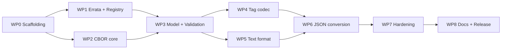

# Metrological CBOR (mCBOR) — TypeScript Reference Implementation

**Work plan, v1.0 — 2026-08-18**

| | |
|---|---|
| Normative input | [spec/README.md](spec/README.md) (CBOR tag 44252, v1.0, 2026-08-14), [spec/IANA-registration.md](spec/IANA-registration.md), [spec/tag-44252-signed-example.md](spec/tag-44252-signed-example.md) |
| Deliverable | A TypeScript NPM module that parses and writes mCBOR (tag 44252) and converts mCBOR documents from/to JSON, where every metrological value becomes a single string (`"230 V"`) |
| Project language | English (code, comments, docs, commit messages) |
| License | Apache-2.0 (matching the Styx reference implementation; note ChargyCore.TS itself is AGPL-3.0 — only its *tooling* is mirrored, no code is reused) |
| Tooling model | [ChargyCore.TS](https://github.com/OpenChargingCloud/ChargyCore.TS): tsup build, Vitest, ESLint flat config, GitHub Actions CI + nightly, scoped public NPM package |

---

## 1. Goal and scope

Build the reference implementation of CBOR tag 44252 for the TypeScript/JavaScript ecosystem: a small, zero-runtime-dependency library that

1. **decodes and encodes** metrological values — exactly, deterministically, and with every MUST of the specification enforced;
2. **renders and parses** a human-readable text form (`"1.10 kWh"`, `"(230.00 ±0.12) V, k=2"`) that is lossless against the binary form;
3. **converts whole CBOR documents from/to JSON**, representing each metrological value as one string.

### In scope

- CBOR tag 44252 codec: value (int / decimal fraction incl. bignum mantissa), unit (registry id, symbol, product of powers with rational exponents), SI prefix, GUM uncertainty (bare number and map form).
- The unit registry of spec §4 as a data file, including aliases, the affine marker (°C), the SenML symbol mapping, and an API to register private-use ids (≥ 32768).
- A minimal deterministic CBOR core (RFC 8949 subset) sufficient to encode/decode tag content and to walk arbitrary CBOR documents for the JSON conversion.
- A specified text grammar (own document) + renderer + parser.
- Document-level JSON conversion in both directions.
- Conformance test suite: golden vectors from spec §5, the worked signed example, property-based round-trips, a negative test per normative MUST.
- NPM publishing with provenance, dual ESM/CJS output, browser + Node.

### Out of scope (deliberately, matching spec §6a)

- COSE signing/verification (a verification *demo* against the worked example lives in `examples/`, with dev-only crypto deps — never in the library).
- Unit *conversion* (Wh→J, °C→K). The registry carries no conversion factors, and the spec warns against naive affine scaling. Comparison stays representation-exact (§6 of the spec).
- Asymmetric uncertainties and correlations (spec §3.4 places them outside the tag).
- Traceability metadata (time, instrument, certificate) — belongs to the carrying document.

---

## 2. What the spec binds the implementation to

A digest of the hard requirements the design below must honor; the full clause-by-clause mapping is a deliverable of WP7 (conformance matrix).

- **Exact decimal arithmetic, no floats — ever.** Values are CBOR ints or tag-4 decimal fractions with int/bignum mantissa. Binary floats and bigfloats (tag 5) are errors as values. JavaScript `number` must never carry a mantissa: `BigInt` throughout.
- **The written representation is data.** `4([-1, 50])` (5.0) and `5` are different resolutions and both must survive decode→encode byte-identically. Same for numeric-id vs. symbolic units.
- **Deterministic encoding** per RFC 8949 §4.2.1: shortest integer heads, definite lengths, sorted map keys. Encoding must be a pure function of (value, scale, unit, prefix, uncertainty) so outputs are signable.
- **Reject, don't guess** (spec §7): unknown unit id or symbol → error, never a placeholder. Resource bounds on exponents and bignum sizes; reject what cannot be represented exactly, never round silently.
- **Validation rules**: array length 2–4; prefix one of the 25 canonical exponents; prefix written explicitly when uncertainty follows; uncertainty non-negative, magnitude/k kept as reported (never normalised to u); coverage probability in ]0, 1]; distribution 0 must be omitted; rational unit exponents reduced to lowest terms, denominator > 0, numerator ≠ 0; a single named unit never encoded as a one-element array; unit id 0 and ids > 65535 invalid.
- **A missing uncertainty means "not stated", never "zero".** The model must distinguish `undefined` from 0.

---

## 3. Key design decisions

Each decision is stated with its recommendation; changing one early is cheap, later expensive. Open points that need the maintainer's word are collected in §10.

### D1 — Own minimal CBOR core, zero runtime dependencies

Implement a small RFC 8949 subset (ints, bignums tag 2/3, decimal fractions tag 4, text/byte strings, arrays, maps, tags, simple values) with a deterministic writer, instead of depending on `cbor2`/`cbor-x`.

*Why:* legal metrology wants an auditable, pinned supply chain (ChargyCore pins even PDF.js for this reason); deterministic byte control and BigInt decimal fractions are exactly the places where generic libraries take liberties; the required subset is small. The Styx reference implementation made the same call.
*Trade-off:* more code to test → mitigated by golden vectors, property tests and fuzzing (WP7). Adapters for `cbor2`/`cbor-x` users are a post-1.0 backlog item.

### D2 — Number model: `bigint` mantissa, spelling-preserving

```ts
type DecimalNumber =
  | { kind: 'int';     value: bigint }                       // wire: major type 0/1
  | { kind: 'decimal'; mantissa: bigint; exponent: number }  // wire: tag 4
```

The `kind` preserves the wire spelling (`5` vs `4([0, 5])` are both legal; only the first is SHOULD). Exponents are validated integers within configurable bounds (default e.g. |e| ≤ 10 000); mantissa size bounded in bytes. Rendering `1.10` from `(mantissa 110, exponent −2)` is pure string arithmetic — no float ever touches the path.

### D3 — Unit model: registry as one data source, wire spelling retained

```ts
type UnitRef    = NamedUnitRef | UnitFactor[];
type NamedUnitRef = { form: 'id'; id: number } | { form: 'symbol'; text: string };
type UnitFactor = [NamedUnitRef, Exponent];
type Exponent   = number | { num: number; den: number };   // reduced, den > 0, num ≠ 0
```

- `src/registry/units.json` is the single source of truth: id, symbol, name, aliases, affine flag, SenML symbol. Code (constants like `Units.Volt`, lookup maps) is generated from it at build time, so spec and code cannot drift.
- Decoded units remember whether the wire said `04` or `"A"` (and which alias), so *preserve* mode re-encodes byte-identically; *canonical* mode (default for fresh values) emits numeric ids and table symbols per the spec's SHOULDs.
- `UnitRegistry.registerPrivate(id ≥ 32768, …)` enables the private-use range per instance; unregistered ids stay errors.

### D4 — Text format: an own specified grammar (the heart of the JSON mapping)

The string form is not cosmetic — it must be **lossless**: mCBOR → string → mCBOR reproduces the same bytes (in canonical mode). That requires a real grammar, published as [docs/text-format.md](docs/text-format.md) (ABNF + normalization rules + test table), frozen in WP5. Cornerstones:

- **Canonical output follows the spec's own diagnostic style**: `5.0 mA`, `9.81 m·s⁻²`, `4.5 nV·Hz^-1/2`, `(230.00 ±0.12) V, k=2`. Integer unit exponents render as superscripts, rational ones in caret form, factors joined by U+00B7.
- **Tolerant input**: ASCII alternatives accepted (`m*s^-2`, `m s^-2`, `um` → µm is **not** accepted — but both micro signs U+00B5/U+03BC are, likewise Ω/Ω U+2126/U+03A9; NFC normalization first). Decimal point only, optional scientific notation (`4.5e-9` ≡ mantissa 45, exponent −10) for extreme scales; digits map exactly to (mantissa, exponent), so trailing zeros survive (`4.500` ≠ `4.5`).
- **Prefix+symbol tokenization**: try the whole token as a registered symbol/alias *first*, then split prefix + symbol. This resolves `cd` (candela, not centi-day), `min`, `Pa`, `Wh`, `mol`, `kat`; `kg` correctly becomes kilo+gram (there is no `kg` in the registry — spec's mass note). Case-sensitive throughout (`t` tonne vs `T` tesla). The full ambiguity table becomes a fixture test. Known oddity to document: `dB` parses as deci-byte, since the bel is not registered.
- **Prefix rendering rule**: fold the prefix into the symbol only where that is SI-correct — single named units with implicit exponent 1 (`mA`, `kWh`, `m°C`). For `m²`, `m³` and products whose first factor's exponent ≠ 1, folding would lie (`km²` ≠ 10³ m²); render `5×10³ m²` instead (input accepts both `×10³` and `e3` spellings).
- **Uncertainty**: `(value ±U) unit` core form; extensions in reported order: `, k=2`, `, p=0.95`, `, dist=normal|rectangular|triangular|u-shape|t`, `, ν=45` (`nu=45` accepted as ASCII input). Exact token set fixed in the grammar doc.
- **Dimensionless (unit `one`)**: rendered as the bare number; a bare number parses back to unit 1. Percent, permille, ppm render with their symbols.

### D5 — JSON conversion: RFC 8949 §6 as base profile + mCBOR extension

Two layers:

1. **Value level** — always available: `value.toString()`, `MetrologicalValue.parse(text)`, and `toJSON()` returning the string, so `JSON.stringify` does the right thing out of the box.
2. **Document level** — `mcborToJson(bytes, options)` / `jsonToMcbor(json, options)` walking whole documents:

| CBOR item | JSON (default) |
|---|---|
| tag 44252 | **string** in the text format (`"1234.567 kWh …"`) |
| map | object (non-text keys: error by default; option `stringifyKeys`) |
| array | array |
| text string | string |
| integer | number if \|n\| ≤ 2⁵³−1, else string (option `numbers: 'string'` forces strings everywhere) |
| float (outside tag content) | number; NaN/±Inf → string (option) |
| byte string | base64url string (option: hex) |
| tag 0/1 | ISO 8601 string |
| true/false/null | native |
| other tags/simple values | error by default; hook `onUnknownTag` |

**JSON → mCBOR**: strings are try-parsed against the strict grammar; a full match becomes tag 44252, everything else stays a string. Because the grammar is anchored and strict, false positives are rare but possible (`"1 h"` as prose) — therefore `paths: include/exclude` (JSON-Pointer) overrides, and a `mode: 'schema-only'` for callers that want zero guessing. Documented round-trip guarantee: mCBOR → JSON → mCBOR is byte-identical for documents within this profile (given canonical encoding and no adversarial look-alike strings).

### D6 — Encode/decode modes

- **Encode**: `canonical` (default — numeric ids, prefix 0 omitted unless uncertainty follows, deterministic bytes) and `preserve` (re-emit exactly what was decoded, for audit round-trips).
- **Decode**: `strict` (default — additionally rejects non-canonical spellings the spec discourages: one-element unit arrays with exponent 1, unreduced rational exponents are *reduced but flagged*, floats anywhere in tag content, duplicate/unsorted map keys, indefinite lengths) and `lenient` (accepts discouraged-but-well-formed input, still rejects every hard MUST violation).

### D7 — Comparison

`equalsRepresentation(a, b)` (field-wise, spelling-sensitive) and `compareQuantity(a, b)` for **same-unit** values via exact mantissa/total-exponent comparison (spec §6: never via prefix conversion, which can overflow). Cross-unit comparison is out of scope (no conversion factors in the registry). Product-of-powers equality treats factors as an ordered display list for representation equality and as a multiset for quantity comparison.

### D8 — Error model with spec traceability

One `McborError` hierarchy with stable machine-readable codes (`ERR_VALUE_FLOAT`, `ERR_UNIT_UNKNOWN`, `ERR_PREFIX_INVALID`, `ERR_UNCERTAINTY_NEGATIVE`, …). Every code carries the spec clause it enforces; the WP7 conformance matrix maps clause → code → test id. This is the auditable story a legal-metrology library needs.

---

## 4. Architecture and repository layout

```
MetrologicalCBOR.TS/
├─ src/
│  ├─ cbor/          # minimal RFC 8949 core: reader, deterministic writer, document walker
│  ├─ model/         # DecimalNumber, Exponent, Prefix, Uncertainty, MetrologicalValue
│  ├─ registry/      # units.json (source of truth) + generated lookup code + private-use API
│  ├─ codec/         # tag 44252 decode/encode, modes, limits
│  ├─ text/          # grammar: renderer + parser (docs/text-format.md is its spec)
│  ├─ json/          # document-level CBOR⇄JSON conversion
│  └─ index.ts       # public API surface (flat, tree-shakeable, sideEffects: false)
├─ tests/            # mirrors src/, plus:
│  └─ vectors/       # golden vectors (spec §5), worked-example bytes, negative-case corpus
├─ docs/             # text-format.md (grammar), conformance.md (matrix), typedoc output
├─ examples/         # usage snippets; optional COSE verification demo (dev-only deps)
├─ spec/             # the normative specification (already present)
└─ .github/workflows # ci.yml, nightly.yml, release.yml
```

### Public API sketch

```ts
import { MetrologicalValue, Units, SIPrefix, mcborToJson, jsonToMcbor } from '@vanaheimr/metrological-cbor';

// construct → encode
const v = MetrologicalValue.of({
  value:       { mantissa: 110n, exponent: -2 },   // "1.10"
  unit:        Units.WattHour,
  prefix:      SIPrefix.Kilo,
  uncertainty: { magnitude: { mantissa: 12n, exponent: -1 }, k: 2, probability: '0.95', distribution: 'normal' },
});
const bytes = v.encode();                          // deterministic, signable

// decode → text
const w = MetrologicalValue.decode(bytes);         // throws typed McborError on any MUST violation
w.toString();                                      // "(1.10 ±1.2) kWh, k=2, p=0.95, dist=normal"
JSON.stringify({ energy: w });                     // {"energy":"(1.10 ±1.2) kWh, …"}  via toJSON()

// text → value
MetrologicalValue.parse('230 V').encode();         // D9 ACDC 82 18E6 05

// whole documents
const json  = mcborToJson(cborBytes);              // metrological values become strings
const cbor2 = jsonToMcbor(json);                   // strings matching the grammar become tag 44252
```

---

## 5. Work packages

Estimates are focused person-days for one senior TypeScript developer, including tests and docs for that package.

### WP0 — Project scaffolding (1–2 d) — **done 2026-08-18**

- `git init`, Apache-2.0 `LICENSE` + `NOTICE`, SPDX headers policy, `README` skeleton, `CONTRIBUTING`, `SECURITY`, `CODE_OF_CONDUCT`, `CHANGELOG` (keep-a-changelog).
- `package.json` (`@vanaheimr/metrological-cbor`, `type: module`, dual `exports`, `files`, `engines: node >= 20`, `publishConfig: { access: public, provenance: true }`), `tsconfig` strict, tsup (ESM + CJS + `.d.ts`), Vitest, ESLint flat config — all mirroring ChargyCore.TS.
- CI workflow: typecheck + lint + test on Node 20/22/24 + bundle smoke test; nightly workflow; release workflow (publish on tag, npm provenance).
- **Acceptance:** met. `npm run verify` green; `npm pack` yields 21 files — `dist/`, `README`, `LICENSE`, `NOTICE`, `CHANGELOG`, `package.json`, no sources — and the tarball imports cleanly in both ESM and CommonJS.
- *Deviation from plan:* type declarations are emitted by `tsc --emitDeclarationOnly` (`build:types`) rather than by tsup's DTS bundler, which injects the `baseUrl` option that TypeScript 6 rejects. This matches ChargyCore.TS, which splits `build:js` and `build:types` for its own reasons.

### WP1 — Spec errata pass and registry freeze (1–2 d) — **done 2026-08-18**

- Unit-id errata A1–A4 (Appendix A): **fixed directly in `spec/README.md` on 2026-08-18.**
- `src/registry/units.json` authored strictly from the §4 *table*: **50 units** (the plan's estimate of 48 was low), aliases, affine flag, SenML symbols, identification ranges. `scripts/generate-registry.ts` validates it and emits `src/registry/units.generated.ts`; `npm run check:registry` fails CI if the two drift.
- **Acceptance:** met. `tests/registry/specification.test.ts` parses `spec/README.md` and compares it with the registry in **both** directions — table rows, alias list, affine marker, SenML paragraph, percent reference, mass note, and the unit-factor examples of §3.2/3.3 — so neither document nor data file can move without the other. 137 tests pass with the spec present.
- The upstream specification at [OpenChargingTechnology/Whitepapers/MetrologicalCBOR](https://github.com/OpenChargingTechnology/Whitepapers/tree/master/MetrologicalCBOR) already carries all four errata; `spec/` is now synced to that copy (revision 1.0, 2026-08-18) and the registry records which revision it was transcribed from. Nothing left to file upstream.
- `spec/` is git-ignored, so a fresh checkout has none. `npm run fetch:spec` downloads it from the public whitepaper repository, and CI runs that before the tests — with `continue-on-error` so a network failure never blocks a pull request, and without it in the nightly workflow, so a persistent problem surfaces within a day. Absent the spec the suite skips (42 pass, 22 skip, 0 fail) rather than breaking.
- *Still open:* the decoder questions A5/A6.

### WP2 — CBOR core (4–6 d) — **done 2026-08-18**

- Reader: ints (64-bit via `bigint`), bignums (tag 2/3), decimal fractions (tag 4), text/byte strings, arrays, maps, nested tags, simple values; well-formedness per RFC 8949 §5 (duplicate map keys rejected).
- Deterministic writer per RFC 8949 §4.2.1: shortest heads, definite lengths, bytewise-sorted map keys.
- Document walker (visitor over a lazily-decoded tree) — the substrate for WP6 and for embedding tag 44252 in host documents.
- Decode limits: max nesting, max byte/element counts, max bignum bytes.
- **Acceptance:** met. 467 tests pass; RFC 8949 Appendix A vectors round-trip byte-exact; 40 000 property-based cases over generated values and over random byte soup; the 713-byte worked-example record decodes, walks three levels of nesting and re-encodes to the identical bytes. Coverage 97 % of statements, 95 % of branches.

**Design decisions taken here**

- **Integers are one type.** Major types 0 and 1 and the bignum tags 2 and 3 all decode to a `bigint`, and the writer picks the preferred encoding for the magnitude. Nothing above the core has to know where the 64-bit boundary falls — which matters, because a metrological mantissa may cross it. The consequence is that a hand-built `tag(2, bytes)` is *rejected* by the encoder rather than written: it is a shape no decoded document ever has, and encoding it would produce bytes that decode to something else.
- **Tags stay uninterpreted otherwise.** The core knows the shape of CBOR, not the meaning of tag 4 or 44252. That is what makes it usable for walking documents whose tags this library has never heard of.
- **`encode` gained `mapKeys: 'preserve'`** alongside `floats: 'preserve'`, forced by the finding below.

**Findings**

- **The worked example's carrying document is not deterministically encoded.** Its meter-reading map is in a human order (`meter, transaction, context, time, energy`), not the bytewise order §4.2.1 sorts into. This is correct and consistent with spec §6, which scopes the deterministic requirement to the *metrological value*, not to the structure carrying it. Two consequences the plan had not anticipated: re-serialising a foreign signed document needs a preserve mode, or the library would silently invalidate signatures it never touched; and strictness is *per layer*, since the outer COSE structure is deterministic while the payload it wraps as an opaque byte string is not.
- **A duplicate map key need not be adjacent.** The first implementation compared neighbours, which is sufficient only in a sorted map. Found while decoding the example in lenient mode; now a set over the whole map, in both reader and writer.
- **Strict mode must require the shortest float width**, including that a NaN is exactly `f97e00` (§4.2.2). A property test over random bytes found `f97c01` — a NaN with a different payload — round-tripping to different bytes.

*Deviation from plan:* the document walker is eager rather than lazily decoding. Laziness is an optimisation, and nothing in WP6 needs it; `walk` and `transform` over a decoded tree are what the JSON conversion will use.

### WP3 — Domain model and validation (3–4 d)

- `DecimalNumber` (D2) with exact string rendering/parsing helpers; `Prefix` (the 25 exponents + symbols incl. `da`); `Uncertainty` (bare vs map, `standardUncertainty({ scale })` helper that divides by k with *explicit* rounding parameters — never silently); `UnitRef` + registry lookups; `MetrologicalValue` as immutable value object.
- Every MUST from §2 of this plan implemented as a typed error with code (D8).
- **Acceptance:** one negative unit test per validation rule; error codes documented.

### WP4 — Tag 44252 codec (2–3 d)

- Decode: tag head, arity 2–4, positional fields, strict/lenient modes, limits plumbed through.
- Encode: canonical and preserve modes (D6); prefix-explicit-when-uncertainty rule; named-unit-never-one-element-array rule.
- **Acceptance:** **all ten §5 vectors byte-exact in both directions**, including the symbolic-unit and rational-exponent rows; the worked example's two `energy` members decode to the documented values (1234.567 kWh, k=2, p=0.95, normal); preserve-mode round-trip byte-identical on every vector; negative corpus (floats, bigfloat, arity 1/5, prefix 4, unit 0, unit 70000, distribution 0, negative uncertainty, unreduced exponents, …) fully red.

### WP5 — Text format: grammar, renderer, parser (5–7 d) — *largest single risk, start early*

- Write [docs/text-format.md](docs/text-format.md): ABNF, normalization (NFC, µ/Ω homoglyphs, superscripts ⇄ carets), tokenization rules (unit-symbol-first, then prefix split), prefix-folding rule and ×10ⁿ fallback, uncertainty extension tokens, dimensionless rendering (D4). Review with maintainer, then freeze.
- Renderer (canonical) + parser (tolerant input per grammar), both float-free.
- Fixture table: every §5 "Reading" string round-trips string → value → canonical bytes → string; ambiguity fixtures (`cd`, `kg`, `min`, `mm`, `mT`, `m°C`, `das`, `t` vs `T`, `dB` caveat); Unicode fixtures (both micros, both ohms, `‰`, `°`).
- **Acceptance:** grammar doc frozen; lossless round-trip property test (arbitrary valid value → string → identical canonical bytes) passes 10⁵ cases.

### WP6 — JSON document conversion (2–3 d)

- `mcborToJson` / `jsonToMcbor` per the D5 table, options (`numbers`, `bytes`, `paths`, `mode`, `onUnknownTag`).
- **Acceptance:** worked-example meter payload converts to the expected JSON (energy as one string) and back to identical bytes; profile edge cases (big ints, byte strings, tag 0) covered; hazard cases (`"1 h"` prose with exclude path) documented and tested.

### WP7 — Hardening and conformance (3–5 d)

- Property-based testing (fast-check) across all three representations; structured fuzzing of the decoder (mutated golden vectors, random byte soup) — decoder must throw typed errors, never crash, hang, or return garbage.
- Resource-bound tests (giant exponents, megabyte bignums, deep nesting) against the limits config.
- [docs/conformance.md](docs/conformance.md): every normative clause → implementation site → test id; gaps drive follow-up work.
- **Acceptance:** conformance matrix complete with zero open MUSTs; fuzz corpus runs in nightly CI; 100 % branch coverage on `codec/` and `text/` paths.

### WP8 — Documentation, examples, release (2–3 d)

- README (badges, quick start, API overview, spec link, ChargyCore-style layout), typedoc API docs, examples incl. the optional COSE verification demo (`@noble/curves` as dev-dependency in `examples/` only).
- Release process rehearsal: `0.1.0` after WP4, `0.2.0` after WP5, `0.3.0` after WP6, `0.9.0` API freeze after WP7.
- **v1.0.0 gate:** the IANA registration of tag 44252 is recorded (spec: "the numeric identifications … become permanent with the IANA registration"). The tag number lives in exactly one constant, mirroring the spec's own guidance, in case 44252 is taken first.
- **Acceptance:** `npm publish` with provenance from the release workflow; install-and-run smoke test of the published package in Node and a browser bundle.

### Dependency graph



WP2 and WP1 can run in parallel; WP5's grammar document can be drafted in parallel with WP4 since it depends only on the model.

---

## 6. Testing and conformance strategy

| Layer | Technique | Source |
|---|---|---|
| Golden vectors | byte-exact encode & decode | the ten §5 examples; worked-example payloads (134/219/713 bytes) |
| Negative corpus | one red test per MUST | spec §§3, 4, 7 — driven by the conformance matrix |
| Round-trips | property-based (fast-check) | bytes ⇄ model ⇄ string, canonical & preserve modes |
| Determinism | re-encode equality, cross-run stability | RFC 8949 §4.2.1 |
| Robustness | structured fuzzing, resource-bound tests | mutated vectors + random input, nightly |
| Interop | walk + convert the signed record; COSE demo in examples | tag-44252-signed-example.md |

CI matrix: Node 20/22/24; bundle smoke test in a headless browser (Vitest browser mode, as in ChargyCore.TS). Nightly runs the fuzz corpus and dependency audit.

---

## 7. Packaging and release (ChargyCore.TS parity)

| Aspect | ChargyCore.TS | This project |
|---|---|---|
| Build | tsup, dual browser/node dist | tsup for **ESM/CJS**, `tsc --emitDeclarationOnly` for `.d.ts` (no environment-specific code needed) |
| Tests | Vitest (node/browser/bundle configs) | same |
| Lint | ESLint flat config, typecheck script | same |
| CI | GitHub Actions CI + nightly | same, plus release workflow with npm **provenance** |
| Package | `@open-charging-cloud/chargy-core`, public scoped | `@vanaheimr/metrological-cbor`, public scoped |
| Engines | Node ≥ 22.13 | Node ≥ 20 (pure data library; BigInt needs only ES2020) — CI tests 20/22/24 |
| Runtime deps | pinned, minimal | **zero** |
| License | AGPL-3.0-only | **Apache-2.0** + NOTICE + SPDX headers |

Versioning: SemVer; 0.x during WP4–WP7 (published early — real feedback beats private polish); API freeze at 0.9.0; 1.0.0 gated on the IANA registration (§5 WP8). `CHANGELOG.md` per keep-a-changelog.

---

## 8. Milestones and effort

| Milestone | Contents | Exit criterion | Est. cumulative |
|---|---|---|---|
| ~~M0~~ | ~~WP0~~ | **done 2026-08-18** — verify green, pack verified in ESM and CJS | 2 d |
| ~~M1~~ | ~~WP1 + WP2~~ | **done 2026-08-18** — registry frozen, errata fixed, CBOR core round-trips the worked example byte-exact | 9 d |
| M2 | WP3 + WP4 → **v0.1.0** | all §5 vectors byte-exact | 15 d |
| M3 | WP5 → **v0.2.0** | grammar frozen, lossless text round-trip | 21 d |
| M4 | WP6 → **v0.3.0** | document JSON round-trip | 24 d |
| M5 | WP7 → **v0.9.0** | conformance matrix complete, fuzzing in nightly | 28 d |
| M6 | WP8 → **v1.0.0** | published with provenance; IANA recorded | 31 d |

Total ≈ **24–36 focused person-days** (the table shows mid-range). Calendar time depends on availability; the critical path is WP2 → WP3 → WP5.

---

## 9. Risks and mitigations

| Risk | Impact | Mitigation |
|---|---|---|
| Tag 44252 taken at IANA before registration | number change | tag number in exactly one constant (spec anticipates this); v1.0.0 gated on registration |
| Spec-internal id contradictions propagate into code | wrong wire data — worst case for metrology | **closed:** errata corrected upstream and locally; registry generated from one validated data file; a test fetched into CI parses the spec and compares both directions |
| Text grammar ambiguities (`dB` → deci-byte; prose strings that parse as values) | silent misinterpretation | unit-symbol-first tokenization, strict anchored grammar, ambiguity fixture table, `paths`/`schema-only` escape hatches, documented pitfalls |
| Unicode homoglyphs (µ/μ, Ω/Ω) and superscripts | parse failures or duplicated spellings | NFC + explicit homoglyph normalization in the grammar, fixture-tested |
| Float leakage (JS ecosystem habit) | resolution loss — spec violation | `bigint` end to end; ESLint rule banning `Number` in `model/`/`codec/`/`text/`; property tests compare exact strings |
| JSON consumers mangling big numbers | data corruption outside our API | numbers > 2⁵³−1 become strings by default; documented |
| Own CBOR core bugs | correctness | **largely mitigated:** RFC 8949 Appendix A vectors, 40 000 property-based cases including random byte soup, the worked example end to end; 95 % branch coverage. The 100 % target for `codec/` and `text/` stays with WP7 |

---

## 10. Open questions for the maintainer

1. **NPM package name/scope** — **decided 2026-08-18: `@vanaheimr/metrological-cbor`** (the scope is available; it matches the repository's own namespace and the Styx reference implementation, rather than the application scope ChargyCore uses).
2. **JSON profile default** — plan assumes: metrological values and CBOR-only types become strings, JSON-native types stay native, with an `everything-as-string` option. Confirm, or make all scalars strings by default?
3. **JSON → mCBOR detection default** — try-parse every string against the strict grammar (convenient, documented hazard) vs. `schema-only` (explicit paths, zero guessing). Plan default: try-parse.
4. **Decoder strictness default** — `strict` rejects discouraged-but-well-formed spellings (`4([0,5])`, `[v, u, 0]` without uncertainty, one-element unit arrays). Plan default: strict on, lenient opt-in. This also needs two decoder-side clarifications in the spec (Appendix A, A5/A6).
5. **Uncertainty text syntax** — the extension tokens beyond the spec's own `, k=2` (`p=`, `dist=`, `ν=`) are this project's invention; review at WP5 grammar freeze — ideally they feed back into the spec as its recommended display form.
6. **COSE demo in `examples/`** — worth the dev-dependency, or defer entirely?
7. **Specification comparison in CI** — **decided 2026-08-18:** `npm run fetch:spec` pulls the document from the public whitepaper repository, so CI enforces the comparison without the specification being committed here.

---

## Appendix A — Spec errata found during planning

**Status: closed.** A1–A4 were corrected locally on 2026-08-18, and the upstream specification (revision 1.0, 2026-08-18) carries the same corrections, so document and registry now agree. The table below records the pre-correction state for the history. A5 and A6 remain open — they are design decisions, not errata.

The §4 **table** and the §5/worked-example **byte encodings are internally consistent** — they are the ground truth the registry data (WP1) is built from. Four prose passages in [spec/README.md](spec/README.md) carried identifications from an apparent earlier numbering and contradicted that table:

| # | Location (§4 prose) | Said | Table says |
|---|---|---|---|
| A1 | Alias list | `Metre` (2), `Ohm` (16), `Cel` (21), `deg` (33) | metre = **15**, ohm = **14**, °C = **7**, degree = **61** (2 = Wh, 16 = g, 21 = Pa, 33 = lx) |
| A2 | SenML paragraph | `Cel` → 21, `/` → 39 | `Cel` → **7**; `/` is listed as an alias of **1** (one) in the same section (39 = sr) |
| A3 | SenML paragraph | "this format's percent (36)" | percent = **6** (36 = Sv) |
| A4 | Note on mass | "the gram (3)", "five kilograms … `(5, 3, 3)`" | gram = **16**, so `(5, 16, 3)` (3 = W) |

Two decoder-side questions the spec leaves open (relevant to D6, WP4):

- **A5** — May a decoder accept a one-element product-of-powers whose exponent is 1 (`[[5, 1]]` for volt)? The encoder MUST NOT write it; the decoder's duty is unstated. Plan: reject in strict mode, accept in lenient.
- **A6** — Is a rational exponent with denominator 1 (`[2, 1]`) valid input, given "reduce to lowest terms" and the int form existing? Plan: normalise to the int form on decode, never emit, flag in strict mode.

The same patch goes upstream in WP1 — before any identifier is frozen into `units.json`.
